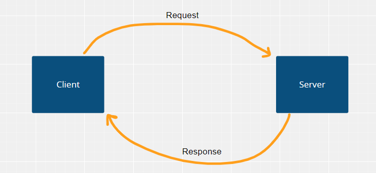
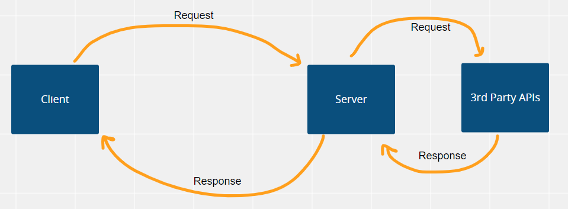

# Movies-Library - Version 1

**Author Name**: Mhamad Belal Al Msalma

## WRRC
### WRRC

### 3rd Party APIs WRRC

## Overview
I will build a movie app that can check the latest movies based on categories

## Getting Started
To execute this application, follow these instructions:

* Copy the SSH link for this repository.
* Clone the repository in your terminal using the following command: `git clone [SSH link]`.
* Type the command `npm init -y` in your terminal to initialize the app.
* Enter the following command in your terminal to install the express framework: `npm install`.
* To run the app and view the output, type the command `npm start` in your terminal.

## Project Features
This is a Node.js program that uses the Express framework and Axios library.
It defines several routes for handling different requests:

* A route with a method of GET and a path of / that responds with a JSON object containing movie data.
* A route with a method of GET and a path of /favorite that responds with a string welcoming the user to the Favorite page.
* A route with a method of GET and a path of /trending that responds with a JSON object containing trending moveis.
* A route with a method of GET and a path of /search that responds with a JSON object containing specific moveis which is **Shark Side of the Moon** movie in this example.
* A route with a method of GET and a path of /credits that responds with a JSON object containing credits of a moveie with id **634649**.
* A route with a method of GET and a path of /popular that responds with a JSON object containing popular movies.
* A route with a method of GET and a path of * that responds with a 404 status code and an error message indicating that the requested page was not found.
* A middleware function that handles server errors by sending a 500 status code and an error message indicating that something went wrong.
* The program also defines a Movie constructor function that creates objects with properties for a movie's title, poster path, and overview.

The program uses a JSON file to populate the movie object with data, and it listens for incoming requests on port 3000, and it uese the APIkey that exists in .env.sample file.